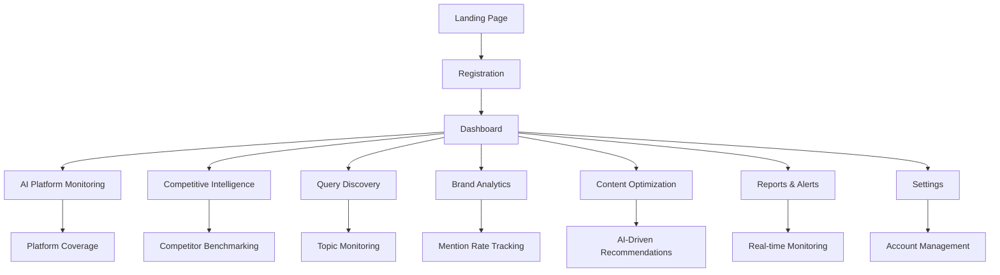

# WhoCrawledMe - AI Agent Intelligence Platform

## 1. Product Overview

WhoCrawledMe is the comprehensive AI-era intelligence platform that monitors, analyzes, and optimizes your brand's visibility across AI platforms and traditional crawlers, providing competitive insights and actionable recommendations.

- **Problem**: 60% of web traffic is AI-driven from platforms like ChatGPT, Claude, and Gemini, but website owners lack visibility into how their content performs in AI-generated responses and competitive positioning.
- **Solution**: End-to-end AI platform monitoring with competitive benchmarking, query discovery, and content optimization recommendations to maximize brand visibility in the AI search era.
- **Market Value**: Pioneer in AI platform analytics with potential to capture the growing GEO (Generative Engine Optimization) market, targeting $100K MRR by month 18.

## 2. Core Features

### 2.1 User Roles

| Role | Registration Method | Core Permissions |
|------|---------------------|------------------|
| Starter User | Email registration + payment | 25K visits/month, 15-day retention, basic analytics |
| Pro User | Email registration + payment | 100K visits/month, 90-day retention, advanced analytics |
| Business User | Email registration + payment | 500K visits/month, API access, custom features |
| Enterprise User | Custom onboarding | Unlimited visits, white-label, SLA support |

### 2.2 Feature Module

Our AI-era intelligence platform consists of the following main pages:

1. **Dashboard**: Real-time activity feed, brand visibility metrics, competitive positioning overview
2. **AI Platform Monitoring**: Track visibility across ChatGPT, Claude, Gemini, and traditional crawlers
3. **Competitive Intelligence**: Benchmark against competitors, share-of-voice analysis, market positioning
4. **Query Discovery**: Identify trending topics, content gaps, optimization opportunities
5. **Brand Analytics**: Mention rate tracking, average rank position, coverage gap analysis
6. **Content Optimization**: AI-driven recommendations, performance insights, strategy suggestions
7. **Reports & Alerts**: Multi-timeframe analysis, real-time monitoring, export capabilities
8. **Settings**: Account management, competitor tracking, notification preferences
9. **Authentication**: Login and registration pages with tier-based access control

### 2.3 Page Details

| Page Name | Module Name | Feature description |
|-----------|-------------|---------------------|
| Dashboard | Brand Visibility Overview | Display mention rate percentage, average rank position trends, share-of-voice metrics with month-over-month changes |
| Dashboard | Real-time Activity Feed | Show live AI platform crawling activity, query discovery updates, competitive mentions with WebSocket updates |
| Dashboard | Quick Insights | Provide actionable recommendations, content optimization suggestions, competitive alerts |
| AI Platform Monitoring | Platform Coverage | Monitor 25+ AI platforms including ChatGPT, Claude, Gemini, Perplexity, Bing Chat, and traditional crawlers |
| AI Platform Monitoring | Query Tracking | Track specific queries and topics being crawled, analyze search patterns, identify trending themes |
| AI Platform Monitoring | Response Analysis | Analyze how content appears in AI-generated responses, track mention context and sentiment |
| Competitive Intelligence | Competitor Benchmarking | Side-by-side comparison of brand mentions vs competitors across AI platforms |
| Competitive Intelligence | Market Share Analysis | Track share-of-voice metrics, competitive positioning, market trend analysis |
| Competitive Intelligence | Gap Analysis | Identify where competitors are winning, missed opportunities, strategic recommendations |
| Query Discovery | Topic Monitoring | Continuously scan for trending queries, themes, and topics across AI platforms |
| Query Discovery | Content Gap Analysis | Identify high-traffic topics where brand is underrepresented, optimization opportunities |
| Query Discovery | Search Pattern Intelligence | Analyze user query patterns, seasonal trends, emerging topics in your industry |
| Brand Analytics | Mention Rate Tracking | Monitor brand mention frequency across platforms with percentage changes and trend analysis |
| Brand Analytics | Rank Position Monitoring | Track average rank position in AI responses with competitive comparison |
| Brand Analytics | Coverage Gap Analysis | Identify topics where brand should appear but doesn't, missed visibility opportunities |
| Content Optimization | AI-Driven Recommendations | Provide specific content suggestions based on AI platform performance and competitive analysis |
| Content Optimization | Performance Insights | Analyze which content performs best across different AI platforms, optimization strategies |
| Content Optimization | Strategy Suggestions | Recommend content structure, metadata, and copy improvements for better AI platform visibility |
| Reports & Alerts | Real-time Monitoring | Continuous scanning with instant alerts for new mentions, competitive changes, trending topics |
| Reports & Alerts | Advanced Analytics | Multi-timeframe analysis, custom dashboards, predictive insights, export capabilities |
| Reports & Alerts | Competitive Alerts | Automated notifications when competitors gain visibility or new opportunities arise |
| Settings | Account Management | Subscription management, usage monitoring, billing information |
| Settings | Notifications | Configure alerts for new agent types, unusual activity, performance thresholds |
| Settings | Integrations | API key management, webhook configuration, third-party service connections |
| Authentication | Login Page | Secure user authentication with email/password, password reset functionality |
| Authentication | Registration Page | Tier-based signup process, payment integration, email verification |

## 3. Core Process

**Primary User Flow (Brand Manager/SEO Professional)**:
1. User registers and adds their brand/domain for monitoring
2. User configures competitor tracking and query themes
3. Platform continuously monitors AI platforms (ChatGPT, Claude, Gemini) for brand mentions
4. User receives real-time alerts and analyzes competitive positioning
5. User implements AI-driven content optimization recommendations
6. User tracks performance improvements and ROI

**AI Platform Monitoring Flow**:
1. Continuous scanning of AI platforms → Query discovery and brand mention detection
2. Competitive analysis → Share-of-voice calculation and ranking position tracking
3. Content analysis → Gap identification and optimization opportunity discovery
4. Real-time dashboard updates → User receives actionable insights and alerts

**Competitive Intelligence Flow**:
1. User adds competitors → System tracks competitor mentions across AI platforms
2. Benchmarking analysis → Side-by-side performance comparison
3. Market trend analysis → Identify winning strategies and missed opportunities
4. Strategic recommendations → Content and positioning optimization suggestions

## 4. User Interface Design

### 4.1 Design Style

- **Primary Colors**: Deep blue (#1a365d) for trust and technology, vibrant green (#38a169) for positive metrics, purple (#805ad5) for AI platform branding
- **Secondary Colors**: Gray scale (#f7fafc to #2d3748) for backgrounds and text, orange (#ed8936) for competitive alerts, red (#e53e3e) for gaps
- **Button Style**: Rounded corners (8px), subtle shadows, hover animations, gradient effects for premium features
- **Typography**: Inter font family, 14px base size, 16px for headings, 18px for key metrics, monospace for technical data
- **Layout Style**: Modern card-based design with competitive comparison tables, split-screen views for benchmarking
- **Icons**: Lucide React icons, custom AI platform logos (ChatGPT, Claude, Gemini), trend arrows, competitive positioning indicators

### 4.2 Page Design Overview

| Page Name | Module Name | UI Elements |
|-----------|-------------|-------------|
| Dashboard | Brand Visibility Overview | Large metric cards with percentage changes, trend arrows, share-of-voice donut charts, competitive positioning radar |
| Dashboard | Real-time Activity Feed | Live AI platform mentions with platform logos, query context, sentiment indicators, competitive alerts |
| AI Platform Monitoring | Platform Coverage | Grid layout with platform status indicators, coverage percentage bars, query volume heatmaps |
| Competitive Intelligence | Competitor Benchmarking | Side-by-side comparison tables, market share pie charts, competitive gap analysis with color coding |
| Query Discovery | Topic Monitoring | Tag clouds for trending topics, search volume graphs, opportunity score indicators, content gap highlights |
| Brand Analytics | Mention Rate Tracking | Time-series charts with multiple metrics, percentage change indicators, benchmark comparison lines |
| Content Optimization | AI-Driven Recommendations | Action cards with priority scores, before/after previews, implementation checklists, ROI projections |
| Reports & Alerts | Real-time Monitoring | Alert feed with severity levels, notification settings toggles, export options with custom date ranges |
| Settings | Account Management | Competitor management interface, query theme configuration, notification preferences with granular controls |

### 4.3 Responsiveness

Desktop-first design optimized for competitive analysis dashboards with mobile-adaptive breakpoints at 768px and 1024px. Touch-optimized interactions for mobile devices with swipe gestures for competitor comparison, expandable metric cards, and priority-based alert notifications. Real-time AI platform monitoring optimized for both desktop analysis and mobile competitive alerts.