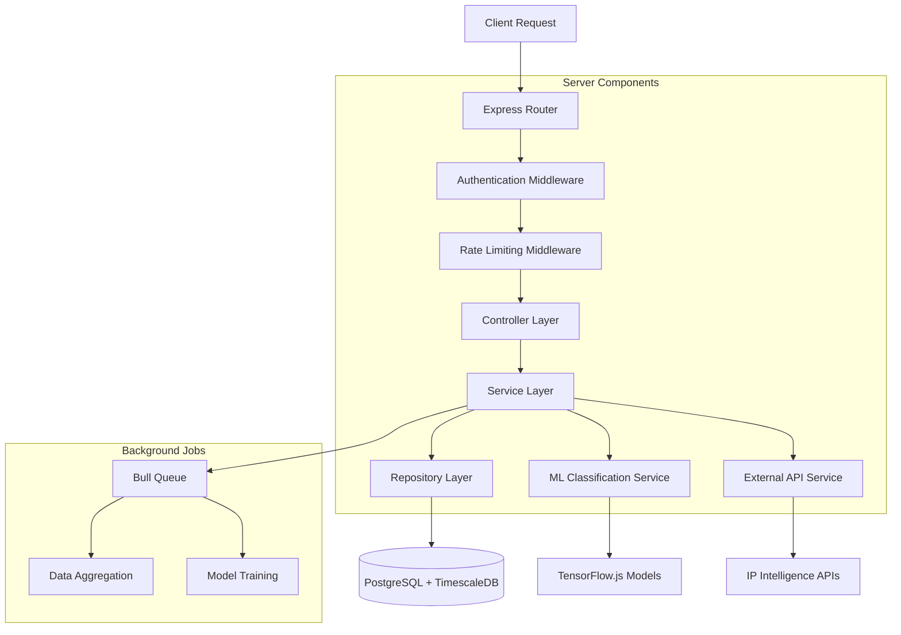

# WhoCrawledMe - Technical Architecture Document

## 1. Architecture Design


## 2. Technology Description

- **Frontend**: React@18 + TypeScript + Tailwind CSS + Vite + Socket.io-client
- **Backend**: Node.js@20 + Express@4 + TypeScript + Socket.io + Bull Queue
- **Database**: PostgreSQL@15 + TimescaleDB@2.11 for time-series data
- **Cache**: Redis@7 for session management and real-time data
- **ML/AI**: TensorFlow.js + Custom classification models
- **Infrastructure**: Vercel (Frontend) + Railway (Backend) + Supabase (Database)

## 3. Route Definitions

| Route | Purpose |
|-------|---------|
| / | Landing page with product overview and pricing |
| /login | User authentication and login |
| /register | User registration with tier selection |
| /dashboard | Main dashboard with real-time activity feed |
| /agents | AI agent detection and classification interface |
| /analytics | Behavioral analytics and session analysis |
| /fingerprinting | Technical fingerprinting and security validation |
| /reports | Reports generation and data export |
| /settings | Account management and configuration |
| /api-docs | API documentation for Business+ tiers |
| /integration | Integration guide and tracking code setup |

## 4. API Definitions

### 4.1 Core API

**Authentication**
```
POST /api/auth/login
```

Request:
| Param Name | Param Type | isRequired | Description |
|------------|------------|------------|-------------|
| email | string | true | User email address |
| password | string | true | User password |

Response:
| Param Name | Param Type | Description |
|------------|------------|-------------|
| success | boolean | Authentication status |
| token | string | JWT access token |
| user | object | User profile and subscription info |

**Agent Detection**
```
POST /api/detect
```

Request:
| Param Name | Param Type | isRequired | Description |
|------------|------------|------------|-------------|
| userAgent | string | true | HTTP User-Agent header |
| ip | string | true | Client IP address |
| headers | object | true | Complete HTTP headers |
| url | string | true | Requested URL |
| timestamp | string | true | Request timestamp |

Response:
| Param Name | Param Type | Description |
|------------|------------|-------------|
| isAIAgent | boolean | Whether request is from AI agent |
| agentType | string | Detected agent type (GPTBot, Claude-Web, etc.) |
| confidence | number | Detection confidence score (0-1) |
| purpose | string | Classified purpose (training/inference/research) |
| geoData | object | Geographic and network intelligence |

**Analytics Data**
```
GET /api/analytics
```

Request:
| Param Name | Param Type | isRequired | Description |
|------------|------------|------------|-------------|
| startDate | string | true | Start date for analytics range |
| endDate | string | true | End date for analytics range |
| agentType | string | false | Filter by specific agent type |
| groupBy | string | false | Group data by hour/day/week |

Response:
| Param Name | Param Type | Description |
|------------|------------|-------------|
| totalVisits | number | Total AI agent visits |
| uniqueAgents | number | Number of unique agent types |
| topAgents | array | Most frequent agent types |
| timeSeriesData | array | Visit data over time |
| performanceMetrics | object | Bandwidth and server impact |

**Real-time Updates**
```
WebSocket: /ws/live-feed
```

Events:
| Event Name | Payload | Description |
|------------|---------|-------------|
| agent_detected | DetectionResult | New AI agent visit detected |
| metrics_update | MetricsData | Updated dashboard metrics |
| alert_triggered | AlertData | Security or threshold alerts |

## 5. Server Architecture



## 6. Data Model

### 6.1 Data Model Definition


### 6.2 Data Definition Language

**Users Table**
```sql
-- Create users table
CREATE TABLE users (
    id UUID PRIMARY KEY DEFAULT gen_random_uuid(),
    email VARCHAR(255) UNIQUE NOT NULL,
    password_hash VARCHAR(255) NOT NULL,
    name VARCHAR(100) NOT NULL,
    subscription_tier VARCHAR(20) DEFAULT 'starter' CHECK (subscription_tier IN ('starter', 'pro', 'business', 'enterprise')),
    usage_count INTEGER DEFAULT 0,
    created_at TIMESTAMP WITH TIME ZONE DEFAULT NOW(),
    updated_at TIMESTAMP WITH TIME ZONE DEFAULT NOW()
);

-- Create websites table
CREATE TABLE websites (
    id UUID PRIMARY KEY DEFAULT gen_random_uuid(),
    user_id UUID NOT NULL REFERENCES users(id) ON DELETE CASCADE,
    domain VARCHAR(255) NOT NULL,
    tracking_code VARCHAR(50) UNIQUE NOT NULL,
    is_active BOOLEAN DEFAULT true,
    created_at TIMESTAMP WITH TIME ZONE DEFAULT NOW()
);

-- Create agent_types table
CREATE TABLE agent_types (
    name VARCHAR(50) PRIMARY KEY,
    description TEXT,
    category VARCHAR(30) NOT NULL,
    detection_patterns JSONB NOT NULL,
    is_active BOOLEAN DEFAULT true
);

-- Create agent_visits table (TimescaleDB hypertable)
CREATE TABLE agent_visits (
    id UUID DEFAULT gen_random_uuid(),
    website_id UUID NOT NULL REFERENCES websites(id) ON DELETE CASCADE,
    agent_type VARCHAR(50) REFERENCES agent_types(name),
    user_agent TEXT NOT NULL,
    ip_address INET NOT NULL,
    url_path TEXT NOT NULL,
    purpose VARCHAR(20) CHECK (purpose IN ('training', 'inference', 'research', 'unknown')),
    confidence_score FLOAT CHECK (confidence_score >= 0 AND confidence_score <= 1),
    headers JSONB,
    geo_data JSONB,
    visit_time TIMESTAMP WITH TIME ZONE NOT NULL DEFAULT NOW(),
    PRIMARY KEY (id, visit_time)
);

-- Convert to TimescaleDB hypertable
SELECT create_hypertable('agent_visits', 'visit_time');

-- Create session_data table
CREATE TABLE session_data (
    id UUID PRIMARY KEY DEFAULT gen_random_uuid(),
    visit_id UUID NOT NULL,
    page_views INTEGER DEFAULT 1,
    dwell_time INTEGER DEFAULT 0,
    bandwidth_used BIGINT DEFAULT 0,
    crawl_pattern JSONB,
    session_start TIMESTAMP WITH TIME ZONE NOT NULL,
    session_end TIMESTAMP WITH TIME ZONE
);

-- Create subscriptions table
CREATE TABLE subscriptions (
    id UUID PRIMARY KEY DEFAULT gen_random_uuid(),
    user_id UUID NOT NULL REFERENCES users(id) ON DELETE CASCADE,
    tier VARCHAR(20) NOT NULL,
    visit_limit INTEGER NOT NULL,
    retention_days INTEGER NOT NULL,
    api_access BOOLEAN DEFAULT false,
    expires_at TIMESTAMP WITH TIME ZONE NOT NULL
);

-- Create api_keys table
CREATE TABLE api_keys (
    id UUID PRIMARY KEY DEFAULT gen_random_uuid(),
    user_id UUID NOT NULL REFERENCES users(id) ON DELETE CASCADE,
    key_hash VARCHAR(255) NOT NULL,
    name VARCHAR(100) NOT NULL,
    permissions JSONB DEFAULT '{}',
    last_used TIMESTAMP WITH TIME ZONE,
    created_at TIMESTAMP WITH TIME ZONE DEFAULT NOW()
);

-- Create indexes for performance
CREATE INDEX idx_agent_visits_website_id ON agent_visits(website_id);
CREATE INDEX idx_agent_visits_agent_type ON agent_visits(agent_type);
CREATE INDEX idx_agent_visits_visit_time ON agent_visits(visit_time DESC);
CREATE INDEX idx_agent_visits_ip_address ON agent_visits(ip_address);
CREATE INDEX idx_session_data_visit_id ON session_data(visit_id);
CREATE INDEX idx_websites_user_id ON websites(user_id);
CREATE INDEX idx_websites_tracking_code ON websites(tracking_code);

-- Insert initial agent types
INSERT INTO agent_types (name, description, category, detection_patterns) VALUES
('GPTBot', 'OpenAI GPT web crawler', 'llm_training', '{"user_agents": ["GPTBot"], "ip_ranges": ["20.15.240.0/20"]}'),
('Claude-Web', 'Anthropic Claude web crawler', 'llm_training', '{"user_agents": ["Claude-Web"], "ip_ranges": ["52.222.0.0/16"]}'),
('PerplexityBot', 'Perplexity AI search crawler', 'search_inference', '{"user_agents": ["PerplexityBot"], "ip_ranges": ["44.242.0.0/16"]}'),
('Bingbot', 'Microsoft Bing crawler with AI features', 'search_inference', '{"user_agents": ["bingbot"], "ip_ranges": ["40.77.0.0/16"]}'),
('Googlebot-AI', 'Google AI training crawler', 'llm_training', '{"user_agents": ["Googlebot"], "ip_ranges": ["66.249.0.0/16"]}');

-- Insert sample subscription tiers
INSERT INTO subscriptions (user_id, tier, visit_limit, retention_days, api_access, expires_at)
SELECT 
    id,
    subscription_tier,
    CASE subscription_tier
        WHEN 'starter' THEN 25000
        WHEN 'pro' THEN 100000
        WHEN 'business' THEN 500000
        WHEN 'enterprise' THEN -1
    END,
    CASE subscription_tier
        WHEN 'starter' THEN 15
        WHEN 'pro' THEN 90
        WHEN 'business' THEN 365
        WHEN 'enterprise' THEN -1
    END,
    subscription_tier IN ('business', 'enterprise'),
    NOW() + INTERVAL '1 month'
FROM users;
```